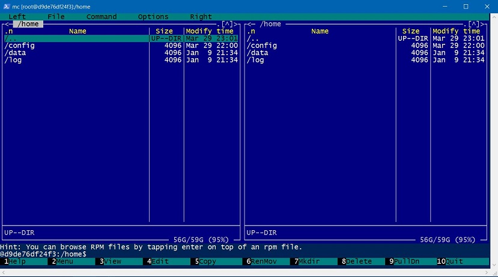
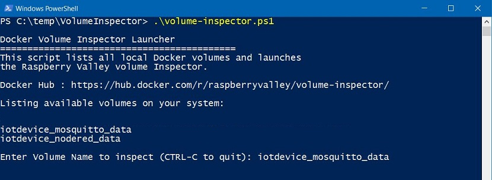

# Raspberry Valley Volume Inspector

Not all of us are command-line gurus and inspecting volumes in our Docker projects can be a challenge.

This is a very small and simple utility which allows you to view volumes and if needed, modify settings within. It is aimed at our users who want to use our Docker images (and linked volumes) without the need to learn the internals.

## Docker Image

Our Docker image is based on [alpine 3.22](https://hub.docker.com/_/alpine/), a minimal Linux image (under 4MB). This image is enhanced with basic tools to browse and view/edit data inside data volumes. Data volumes are linked to the home directory of the *Volume Inspector*. Total size is roughly 24MB.

The image contains also the following tools:

* [Midnight Commander](http://midnight-commander.org/) - a GNU visual file manager. Those of you who have been using *Norton Commander* become immediately power users
* [Nano Editor](https://www.nano-editor.org/) - A lightweight GNU text editor. We chose it simply because our makerspace users have it as a main text editor on Raspberry Pi

> Both this image and powershell scripts work with [Podman](https://podman.io/) too! Just replace all docker commands with 'podman'.

## Getting the Inspector

You can pull the [Volume Inspector](https://hub.docker.com/r/raspberryvalley/volume-inspector) from our Raspberry Valley Docker Hub. Simply type the following:

```bash
docker pull raspberryvalley/volume-inspector
```

## Building your own Inspector

If you don't want to use our pre-made image, simply build your own. This is a sign of sanity: be careful about using 3rd party images: a bit of paranoia helps.

To build your own image, follow the steps below:

* clone this repository
* Open up PowerShell (or the command prompt) and navigate to the repository folder (where the Dockerfile is located)
* Update/modify the Dockerfile to your liking, then invoke the build command:

```bash
docker build -t "raspberryvalley/volume-inspector" .
```

## Using the Inspector

To use the *Inspector*, first locate the Docker volume you wish to inspect. To list volumes, simply type:

```bash
docker volume ls
```

You can use some command-line parameters to fine-tune the output, but all the data is in the simple command described above.

Once you have identified the name of the volume of interest, run our *Inspector* (substitute 'YourVolumeName' with the volume name you have found in the step above):

```bash
docker run --rm -it -v YourVolumeName:/home raspberryvalley/volume-inspector
```

*Volume Inspector in action (looking at Mosquitto configuration files)*:


You are basically creating a temporary container (it will be removed after use due to the '--rm' switch), which maps 'YourVolumeName' to the home directory of Alpine, and which launches the Midnight commander to inspect and edit files.

To close *Inspector* (and delete the container), simply press **F10** (this closes Midnight Commander), or type

```bash
exit
```

## PowerShell Script for Inspector

to simplify life even more, use our Powershell script. Simply copy to a place which is on your path, and then in powershell, type:

```bash
volume-inspector.ps1
```

The script will first list all the volumes available, then prompt you for the volume name you wish to inspect, and finally launch the Docker image of Inspector.

*PowerShell Script for Volume Inspector*:


## Powershell Scripts for Volume Backup

As a bonus, we're adding PowerShell scripts to backup the volume content to your host machine. Simply run the script **volume-backup.ps1** to copy all content from a given volume to your host machine or **volume-backup-tar.ps1** to backup the volume to your host machine as a compressed file. This is useful for restoring your volume content elsewhere.

## About

Raspberry Valley is a maker community in Karlskrona, Sweden, sponsored by [Dynapac](https://dynapac.com/en). We run makerspaces, working with Raspberry Pis, Arduinos and other interesting hardware.

This repository is here to support our community of makers. A lot of our achievements are based and inspired by the community at large. We wish to pay back and share our experiences and lessons learned. Join us!

You can find our pages here: [Raspberry Valley](https://raspberry-valley.azurewebsites.net). You can also check [Docker Hub](https://hub.docker.com/r/raspberryvalley/) for images of interest.

## Links

* [Volume Inspector on Docker Hub](https://hub.docker.com/r/raspberryvalley/volume-inspector/)
* [Volume Inspector on Github](https://github.com/raspberryvalley/docker-volume-inspector) (this repository)

Raspberry Valley makerspace links

* [Raspberry Valley](https://raspberry-valley.azurewebsites.net) - Other things we make and do
* [Raspberry Valley on Github](https://github.com/raspberryvalley)
* [Raspberry Valley Docker Hub Images](hub.docker.com/r/raspberryvalley/)
